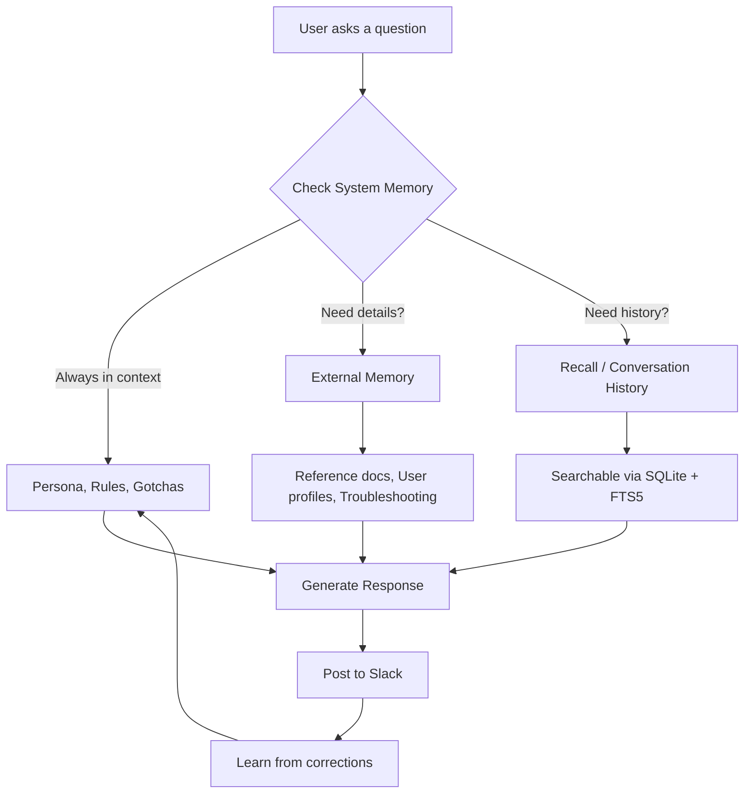
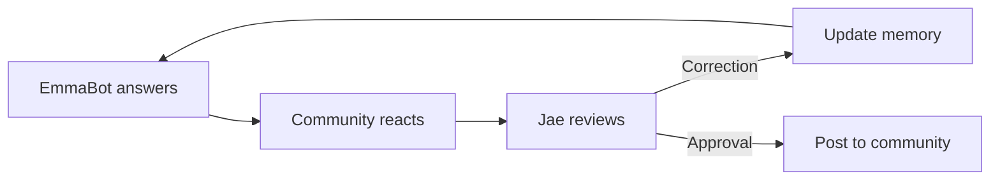

# Building EmmaBot's Brain

## How we gave a Slack bot persistent memory — and why it matters

---

## The Problem

LLMs are goldfish.

Every conversation starts from zero. No context, no history, no personality. You ask a Domo question, you get a generic answer. Ask the same question tomorrow? Same generic answer. No learning. No improvement.

For a community bot, that's a dealbreaker.

---

## The Architecture

We built a **tiered memory system** — three layers, each with a different job:



---

## Layer 1: System Memory (Always In Context)

These files are **pinned into the system prompt** — visible every single turn, no retrieval needed.

| File | Purpose |
|------|---------|
| `identity.md` | Who I am, who I represent, boundaries |
| `community.md` | Who I serve (DUG members) |
| `priorities.md` | Mission: help, share, be present |
| `response-rules.md` | How to answer, when to escalate |
| `hygiene.md` | Gotchas, anti-patterns, bug traps |
| `knowledge.md` | Durable Domo platform knowledge |

**Key insight:** If EmmaBot keeps forgetting a rule, it goes in system memory. We learned this the hard way — the response template was in external memory and got ignored constantly. Promoted it to system memory, problem solved.

---

## Layer 2: External Memory (On-Demand)

An index of files lives in the system prompt, but full contents are **loaded only when needed**.

| Directory | Contents |
|-----------|----------|
| `reference/` | API docs, Domo patterns, crew-dcs templates |
| `users/` | 88 community member profiles |
| `troubleshooting/` | Diagnostic runbooks |

**Why not put everything in system memory?** Context windows have limits. External memory keeps the prompt lean while making knowledge discoverable.

---

## Layer 3: Conversation History (Recall)

Every message is stored in a **SQLite database with FTS5 full-text search**.

```python
import sqlite3
conn = sqlite3.connect("/workspace/dc_public_memories/messages.db")
cur = conn.execute(
    "SELECT text, user_id FROM messages_fts WHERE text MATCH 'beast mode' LIMIT 5"
)
```

327+ messages across 13 DUG channels. Searchable even after they leave the context window.

---

## The Knowledge Store

On top of memory, we built a **local Domo docs database**:

- **1,919 Domo support articles** parsed from the documentation hub
- **FTS5 + TF-IDF hybrid search** for accurate retrieval
- **34,969 NER entities** (connectors, features, roles)
- **Wiki generation** — when an answer is partial, a wiki stub is auto-created

```python
python3 /workspace/dc_public_memories/query_domo_docs.py "beast mode case statement"
```

This means EmmaBot checks local docs *before* hitting the web. Faster, cheaper, more accurate.

---

## The Git Layer

Memory is **git-tracked**. Every correction, every new rule, every gotcha — it's all in the commit history.

```bash
git log --oneline
# 04f2820 add: push to Google Docs after markdown drafting
# 67ff2c4 Promote response template to system memory block
# d648dfb fix: add Slack response template to hygiene gotchas
# 3bef241 fix: reply in the active thread, not top-level
```

The commit log *is* the training log. You can see exactly what we taught, when, and why.

---

## The Flywheel



1. **Answer** — EmmaBot responds to a community question
2. **Review** — Jae checks the draft before it goes public
3. **Correct** — Mistakes become memory updates
4. **Improve** — Next time, EmmaBot knows better

Every mistake is a learning opportunity. Every correction is permanent.

---

## Reproducing This

If you want to build something similar:

1. **Start with Letta Code** — it gives you the memory filesystem, git sync, and channel integrations out of the box
2. **Seed system memory early** — identity, boundaries, and response rules should be in context from day one
3. **Build a knowledge store** — local docs beat web search for domain-specific accuracy
4. **Track everything in git** — the commit history is your audit trail and training log
5. **Promote forgetful rules to system memory** — if the bot keeps ignoring a rule, it's not in the right layer
6. **Add a human review loop** — draft in a private channel, approve before posting publicly

---

## The Stack

| Component | Technology |
|-----------|-----------|
| Agent runtime | Letta Code (Docker on VPS) |
| Memory | Git-backed filesystem (MemFS) |
| Knowledge store | SQLite + FTS5 + TF-IDF |
| Channel integration | Slack Bolt (Socket Mode) |
| MCP server | mdrag (DataCrew RAG) |
| Google Docs | cboti (markdown-to-Docs converter) |
| Secrets | Infisical |

---

_Built by Jae Wilson and the DataCrew team. EmmaBot is a service provided by DataCrew — [datacrew.space](https://datacrew.space)_
